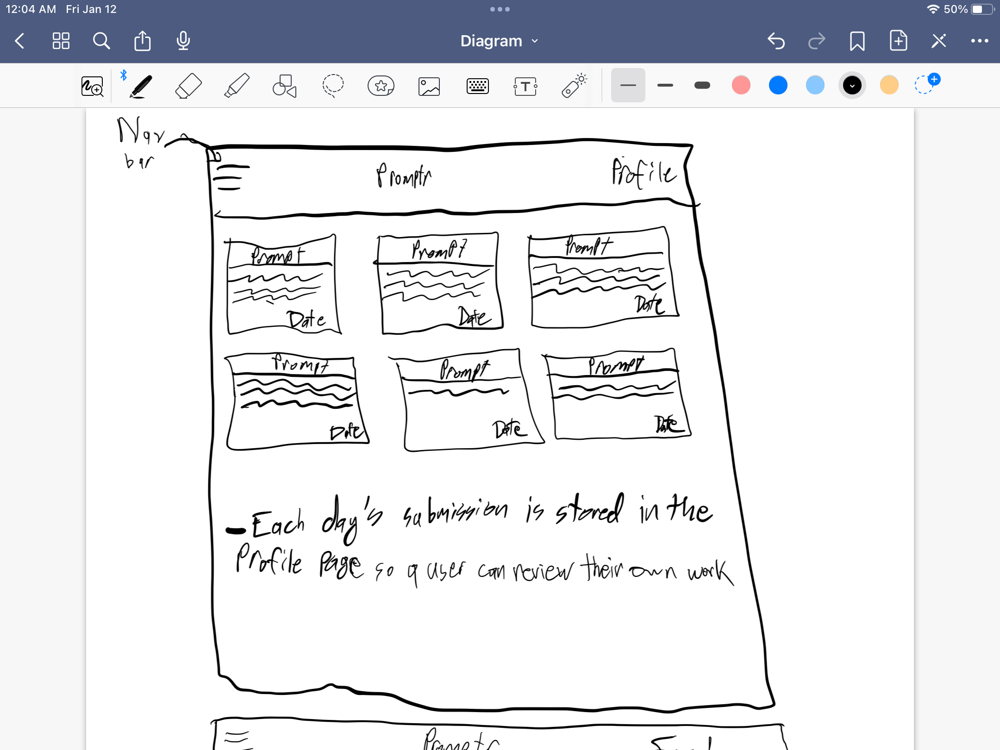

# Startup
CS260 Startup Application project

## Elevator Pitch
I love creative writing, but I almost never have time for it anymore. That is, I never make time for it anymore, and I don't want to bite off more than I can chew, so I hold myself back from starting on anything. That's where Promptr comes in. Everyday at 9:00 am a new prompt is put up that every user gets, or they can choose to "free-write". Users can see each other's work, and you can keep yourself accountable for writing every day!

### Key Features
- Profile creation and Login
- Viewing your profile with everything you have written on the site
- Viewing what other users have written using the site
- Selecting whether to write based on a prompt or free-write
- Time related update from the server to change to a new prompt every day
- Being able to submit what you have written

### Service Deliverable
- Relevant changes can be observed on the "write" page of the website
- Added Express and Node capabilities to the website
- Re-implemented my submit function using HTTP Endpoints
- Put a third party call similar to the Simon one that generates a quote. This is displayed below the box on the "Write" page

### JavaScript Deliverable
- Implemented the functionality of the buttons
- You can now register a username and password to use to login with
- You can choose whether to write based on a prompt or to use the "Free Write" option
- You can submit whatever you wrote in the write page

### CSS Deliverable
- Changed the color theme to be a dark grey with burlywood accents
- Centered everything
- Made the html tables look good, and fit them to be three across. Also made them flex fit
- Made the pages scrollable
- On the write page I made the textarea larger and made it so it couldn't be resized
- Fixed the header and footer positions

### HTML Deliverable
- Added the html files to structure the basics of the page.
- Write page exists for a user to write based on a prompt
- Read page exists for a user to read other user's writings for the day
- Home page exists for a user to read their own work that they've written using Promptr 

### Technologies
- __HTML__: Using correct HTML for application. Four pages: one for login, viewing previously written projects in a profile, viewing what others have submitted in a feed, and one to write and submit
- __CSS__: Dynamic sizing, good whitespace, and general color theme
- __JavaScript__: Login, Navigation Bar, displaying information, updating prompts
- __Service__: Backend service with endpoints for: 
    1. Login
    2. Retrieving submissions
    3. Submitting
- __DB/Login__: Store users, and submissions in database. Register and login users. Credentials securely stored in database. Can't submit or view feed unless authenticated.
- __WebSocket__: As users make submissions, make them viewable to other users on the feed and to themselves on their profiles
- __React__: Port application to use the React framework

### Diagram

